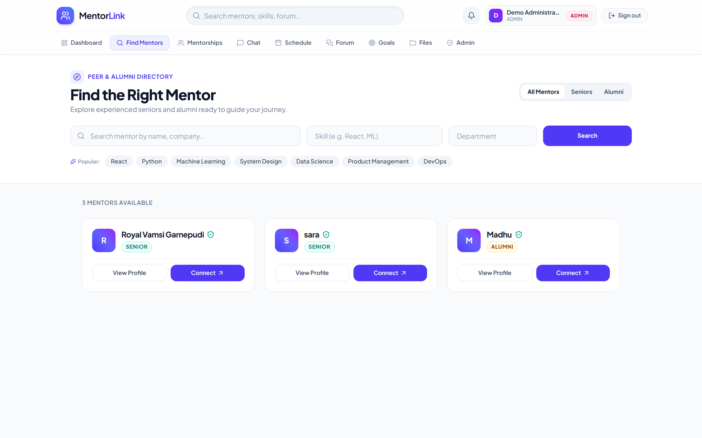
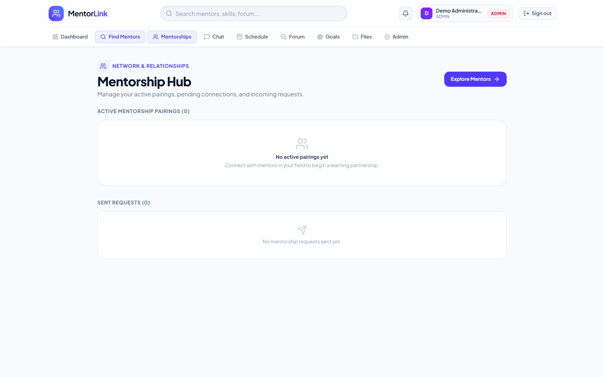
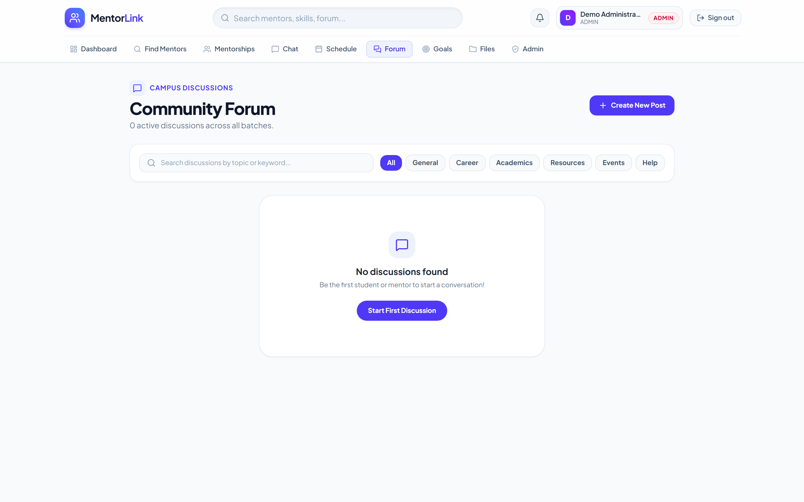
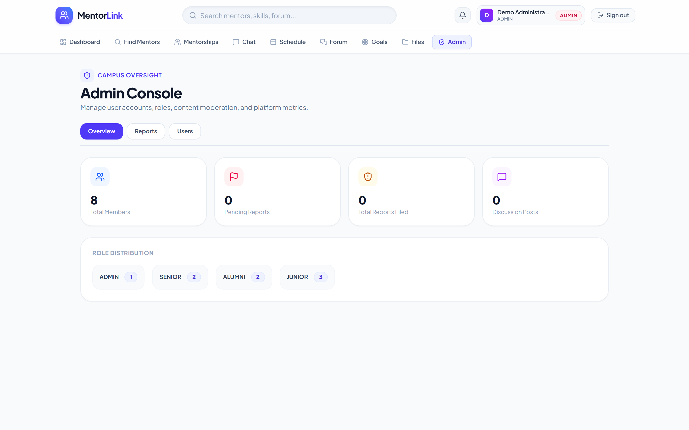
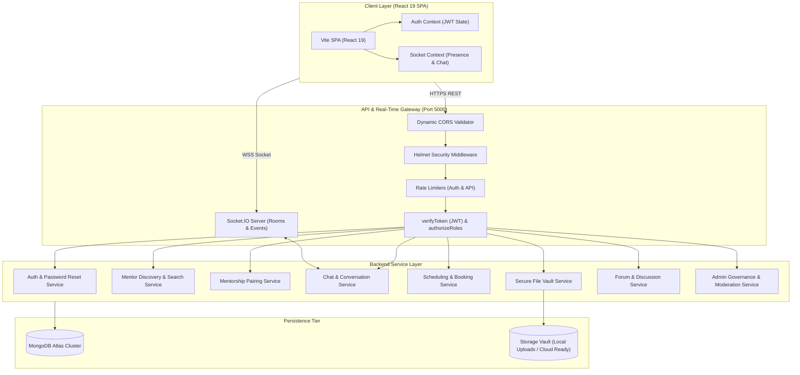

# MentorLink

> **Real-time college mentorship platform connecting junior students, senior peers, and alumni.**

[](https://www.typescriptlang.org/)
[](https://react.dev/)
[](https://nodejs.org/)
[](https://expressjs.com/)
[](https://www.mongodb.com/)
[](https://socket.io/)
[](https://tailwindcss.com/)
[](backend/src/tests)

**GitHub Repository:** [https://github.com/royalvamsi/mentorlink](https://github.com/royalvamsi/mentorlink)

---

## Why I Built MentorLink

Students often have access to talented seniors and alumni within their college community, but there is no cohesive way to discover the right mentor, request mentorship, communicate in real time, schedule sessions, and maintain academic relationships in one place.

I built MentorLink to unify these interactions into a single campus ecosystem. The platform supports both directions of mentorship: students find experienced mentors, while seniors and alumni can mentor others and simultaneously seek guidance from industry veterans.

---

## What I Built

I designed and implemented the full-stack platform across:
- **React 19 + TypeScript SPA:** Type-safe components, responsive UI, and custom contexts for auth & sockets.
- **Node.js + Express 5 Backend:** Modular service layer with RESTful endpoints and error handling.
- **MongoDB Atlas Persistence:** Flexible schemas for profiles, mentorship pairs, chats, and audit reports.
- **Real-Time WebSockets:** Low-latency 1-on-1 chat and online presence powered by Socket.IO.
- **Defense-in-Depth Security:** RBAC middleware, IDOR file isolation, and ReDoS query sanitization.
- **Comprehensive Testing:** 71 automated unit/integration tests and an automated multi-persona E2E suite.

---

## Screenshots

| Landing Experience | Peer & Alumni Discovery |
| :---: | :---: |
|  |  |

| 1-on-1 Mentorship Hub | Campus Forum & Discussions |
| :---: | :---: |
|  |  |

| Administrative Governance Console |
| :---: |
|  |

---

## Key Features

- **Multi-Persona Role-Based Access Control (RBAC):** First-class support for `JUNIOR` (mentees), `SENIOR` (peer mentors), `ALUMNI` (industry coaches & dual-role participants), and `ADMIN` (campus oversight).
- **Mentorship Request Lifecycle:** Structured matching pipeline: Search $\rightarrow$ Profile Exploration $\rightarrow$ Request Submission with Notes $\rightarrow$ Acceptance/Rejection $\rightarrow$ Active Pairing.
- **Real-Time Communication:** Persistent Socket.IO messaging engine with active room scoping, typing indicators, read receipts, and graceful disconnection recovery.
- **Calendar Scheduling & Slot Reservation:** Mentors configure availability windows; students book 1-on-1 consultation sessions with automated status transitions.
- **Access-Controlled Academic Vault:** Centralized resource library for notes, interview guides, and project templates with strict tenancy-based download isolation.
- **Campus Forum & Content Moderation:** Community discussions with comment threading, vote tracking, and a dedicated admin moderation queue for reported content.
- **Administrative Governance Console:** Member directory lookup, dynamic role elevation/demotion, moderation resolution audits, and live campus health metrics.

---

## Tech Stack

| Layer | Technology | Rationale |
| :--- | :--- | :--- |
| **Frontend Framework** | React 19 + TypeScript + Vite 8 | Ultra-fast HMR, strict type safety, and optimized rolldown chunking. |
| **Styling & Design** | Tailwind CSS v4 + Lucide Icons | Utility-first responsive design, modern dark/light contrast, curated color tokens. |
| **Backend Runtime** | Node.js + Express 5 (TypeScript via `tsx`) | Non-blocking I/O, native async error handling, and end-to-end type sharing. |
| **Database & ODM** | MongoDB Atlas + Mongoose 9 | Flexible document modeling for nested profiles, conversations, and mentorship graphs. |
| **Real-Time Protocol** | Socket.IO 4.8 | Low-latency WebSockets with HTTP long-polling fallbacks and targeted room broadcasts. |
| **Security & Auth** | JWT + bcryptjs (12 rounds) + Helmet | Stateless token verification, salted credential hashing, and secure HTTP response headers. |
| **Testing Suite** | Node Native Runner (`tsx --test`) + Vitest | Zero-dependency, high-speed test execution across unit, integration, and E2E suites. |

---

## Architecture



---

## Security & Authorization

MentorLink employs a defense-in-depth security model across the entire application:

1. **Role-Based Access Control (RBAC):**
   - Role enforcement is validated on every sensitive route via `authorizeRoles(...)` and `requireAdmin(...)`.
   - `ADMIN` cannot be self-selected during public registration (`auth.service.ts` rejects any client-supplied admin role).
2. **Insecure Direct Object Reference (IDOR) Prevention:**
   - Mentorship files are strictly partitioned: users can only download files if they are the direct uploader, part of the active mentorship pairing, or if the file is explicitly marked public by the owner.
3. **Regex Injection (ReDoS) Sanitization:**
   - All directory and user search queries pass through an `escapeRegex()` utility prior to hitting MongoDB, neutralizing regular expression denial-of-service vectors.
4. **Token Security & Expiration:**
   - Stateless JWT tokens signed with high-entropy 256-bit secrets.
   - Password reset tokens are generated using `crypto.randomBytes(32)`, stored solely as SHA-256 hashes in MongoDB, and strictly expire in 15 minutes.
5. **Brute-Force & Rate Limiting:**
   - Public authentication endpoints are throttled using windowed IP rate limiting to mitigate credential stuffing attacks.

---

## Testing

The platform is backed by comprehensive automated test coverage across unit, integration, and full-spectrum end-to-end workflows:

```
✔ Backend Security & Unit Tests:      61 / 61 passed
✔ Frontend UI & Logic Tests:          10 / 10 passed
✔ Multi-Persona Product E2E Suite:    12 / 12 milestones passed
--------------------------------------------------------------
Total Test Assertions:                71+ automated tests (100% pass)
```

### Verified Test Areas:
- **API Boundary & 401/403 Protection:** Unauthenticated access prevention across all protected resources (`/profile`, `/mentors`, `/chat`, `/scheduling`, `/files`, `/admin`).
- **Domain Logic:** Availability collision detection, goal completion math, MIME whitelist verification, and rating boundary checks.
- **Search & Recommendation:** Jaccard similarity indexing, text overlap scoring, and ReDoS sanitization.
- **End-to-End Product Lifecycle:** Automated execution of Student $\rightarrow$ Mentor pairing, real-time message delivery, calendar reservation, authenticated file streaming, alumni peer exchange, and admin governance.

To execute tests locally:
```bash
# Backend test suite (61 tests)
cd backend && npm test

# Multi-persona E2E test suite (12 milestones)
cd backend && npx tsx src/tests/e2e_full_system.ts

# Frontend test suite (10 tests)
cd frontend && npm test
```

---

## Getting Started

### Prerequisites
- **Node.js** >= 18.0.0
- **npm** >= 9.0.0
- **MongoDB Atlas** database connection string (or local MongoDB instance)

### 1. Clone the Repository
```bash
git clone https://github.com/royalvamsi/mentorlink.git
cd mentorlink
```

### 2. Backend Setup
```bash
cd backend
cp .env.example .env
```
Edit `backend/.env` and supply your database URI and JWT secret:
```env
PORT=5000
MONGO_URI=mongodb+srv://<username>:<password>@<cluster>.mongodb.net/mentorlink?retryWrites=true&w=majority
JWT_SECRET=your_super_secret_high_entropy_key
CLIENT_ORIGIN=http://localhost:5173
```
Install dependencies and run the development server:
```bash
npm install
npm run dev
```
Backend API will be live at `http://localhost:5000` (Health check: `http://localhost:5000/api/health`).

### 3. Frontend Setup
In a new terminal:
```bash
cd frontend
cp .env.example .env
```
Ensure `frontend/.env` points to the backend API:
```env
VITE_API_URL=http://localhost:5000
```
Install dependencies and start the Vite dev server:
```bash
npm install
npm run dev
```
Open `http://localhost:5173` in your browser.

---

## Engineering Challenges & Solutions

### 1. Private File Isolation vs. Public Campus Resources (IDOR Prevention)
- **Challenge:** The campus library needed to serve public educational resources (syllabus notes, interview sheets) to all students while keeping private documents shared inside 1-on-1 mentorship pairings completely inaccessible to outside users. Initial queries leaked private mentorship files into the global library listing.
- **Solution:** Implemented tenant-aware database filtering in [`file.service.ts`](backend/src/services/file.service.ts). Unscoped queries are strictly constrained to `{ mentorshipId: { $in: [null, undefined] }, conversationId: { $in: [null, undefined] } }`. In addition, the file streaming controller executes an ownership check (`verifyFileAccess`) prior to releasing read streams, returning `403 Forbidden` for unauthorized IDs.

### 2. Dynamic CORS Handling with Ephemeral Development Ports
- **Challenge:** When running multiple instances of Vite or parallel browser previews, Vite dynamically allocates ports `5173`, `5174`, `5175`, or `5176`. Hardcoded origin strings caused preflight CORS failures on registration and login.
- **Solution:** Replaced static origin strings with an origin validator [`backend/src/config/cors.ts`](backend/src/config/cors.ts) using regex matching (`^https?:\/\/(localhost|127\.0\.0\.1)(:[0-9]+)?$`). Applied this unified check across both Express CORS middleware and the Socket.IO server engine.

### 3. Client-Side Session Hydration & Silent Expiration Prevention
- **Challenge:** On application refresh, Axios interceptors immediately attempted token verification. If a user navigated to public auth pages (`/login`, `/register`, `/forgot-password`), invalid credentials returned `401 Unauthorized`, which triggered a recursive auto-logout loop that cleared session storage and redirected the user unexpectedly.
- **Solution:** Configured the global Axios response interceptor in [`authService.ts`](frontend/src/services/authService.ts) to explicitly whitelist public authentication endpoints, preserving clean error feedback in the UI without resetting the user's state.

### 4. Vite Bundle Optimization & Production Code Splitting
- **Challenge:** Inclusion of heavy client libraries (`socket.io-client`, `axios`, and `lucide-react`) caused monolithic vendor chunk warnings in Vite production builds (>500 kB).
- **Solution:** Reconfigured `manualChunks` in [`vite.config.ts`](frontend/vite.config.ts) to segment dependencies into isolated vendor bundles: `vendor-react` (React, React Router), `vendor-socket` (`socket.io-client`), and `vendor-http` (`axios`). Reduced initial JavaScript parse time and optimized cache invalidation for browser clients.

### 5. Multi-Persona Alumni Experience (Mentors Who Also Need Mentors)
- **Challenge:** Traditional mentorship portals treat participants as strictly binary (either Mentee or Mentor). However, alumni in their early careers (0–3 years) often require senior executive coaching and peer networking while simultaneously mentoring undergraduate juniors.
- **Solution:** Architected the mentorship service layer so that `menteeId` has no role restriction. An `ALUMNI` account can both receive incoming guidance requests from students and initiate outgoing mentorship inquiries to senior alumni, with the dashboard dynamically surfacing both relationships.

---

## Future Improvements

- [ ] **Cloud Storage Adapter:** Migrate from local filesystem storage (`multer.diskStorage`) to AWS S3 or Google Cloud Storage with signed upload URLs.
- [ ] **Distributed Socket Adapter:** Implement `@socket.io/redis-adapter` to allow horizontal multi-instance scaling of WebSockets across clustered nodes.
- [ ] **Transactional Email Provider:** Integrate Resend or Nodemailer with campus SMTP for verified email deliverability of password reset links.
- [ ] **Containerized Deployment:** Add multi-stage `Dockerfile` and `docker-compose.yml` for reproducible staging and production deployments.

---


